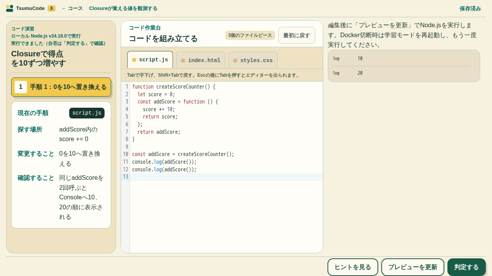
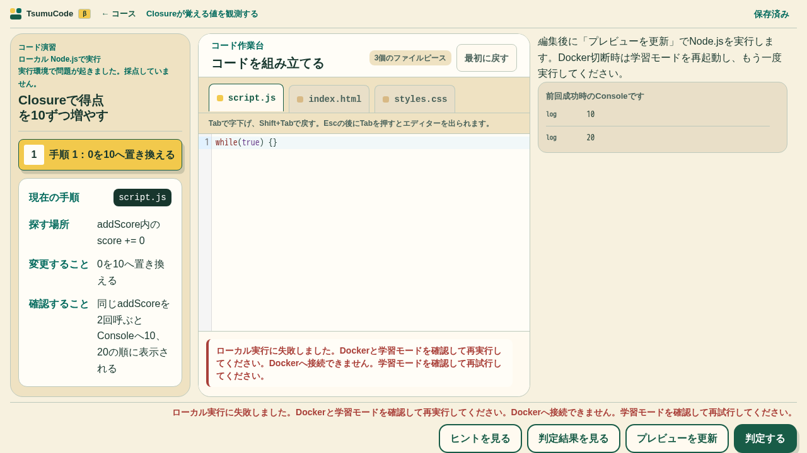
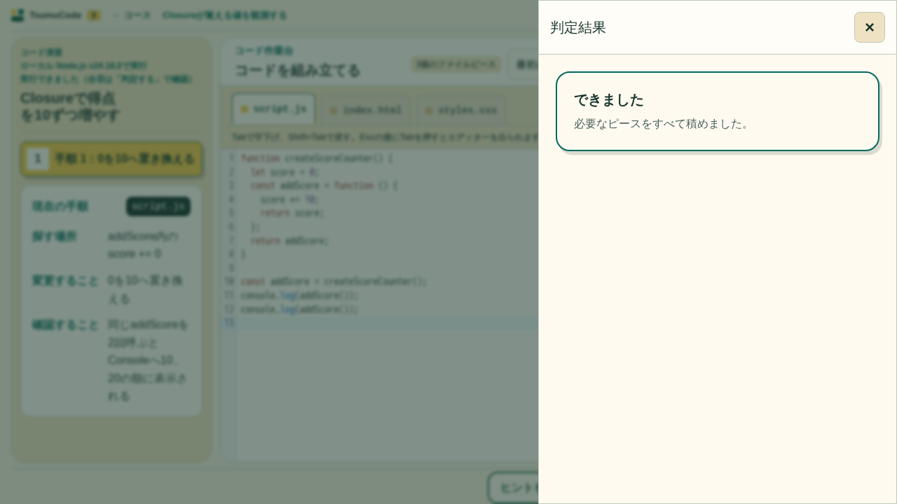

# ローカル Node 実行（Issue #28）

状態: 実Node・実UI・関連回帰を検証済み。独立PRレビューとCIの完了前であり、Issue完了とは扱わない。

## 要件台帳（初版）

| ID      | 区分 | 受入条件                                                                       |
| ------- | ---- | ------------------------------------------------------------------------------ |
| REQ-001 | 維持 | 既存 Closure `javascript-ch03-l05-e01` の編集→実 Node 出力→採点→再読込         |
| REQ-002 | 維持 | 同一 loopback origin、専用 web と controller、実行ごとに別コンテナ             |
| REQ-003 | 維持 | controller のみ socket。厳格な Host/Origin/token、固定 profile、入力制限       |
| REQ-004 | 維持 | 非root、rootfs read-only、network none、cap drop、CPU/メモリ/PID/時間/出力上限 |
| REQ-005 | 維持 | 外部停止・古い結果の失効・自身の資源回収。障害を不正解保存しない               |
| REQ-006 | 維持 | 同じ教材ID・進捗・下書き・JSON Import/Export。PagesへLocal接続を混入しない     |
| REQ-007 | 維持 | 架空DOMを作らずsource/console採点。Browser安全policyは維持                     |
| REQ-008 | 維持 | 実Docker・実UI・関連回帰・容量検証の証拠を残す                                 |

非対象: PTY、任意パッケージ導入、常駐学習サーバー、Python/Next、公開マルチテナント、クラウド同期。

初期上限: 同時実行1、CPU 1、メモリ256 MiB、PID 64、実行5秒、stdout/stderr合計64 KiB。コンテナ準備時間と実行時間は別に記録する。

## 境界

専用 Compose の web だけを `127.0.0.1:4173` に公開する。web は静的UIと固定 `/api/` proxy。controller は内部ネットワークのみで待受し、Docker socketから固定profileの使い捨てNodeを作る。既存開発用 `app` は起動しない。

controller の socket権限はホスト管理相当である。`read-only` mountにしてもDocker API権限は制限されない。learnerにはsocket、リポジトリ、Git、環境秘密、ホームディレクトリを渡さない。Docker単体を敵対する第三者のコードの完全な隔離と宣伝しない。個人のローカル学習用である。

Nodeへのコード受け渡しは正規化済みの教材ファイルだけ。実行コマンド・image・Docker optionsをHTTP入力から選ばない。固定bootstrapが一時workspaceへファイルを書き、固定entryを実Nodeで起動する。出力は学習者のplain textであり管理プロトコルではない。

Localの編集時は保存だけを予約し、Preview／判定で明示実行する。Browserの自動Previewは維持する。Node採点は同じrun identity、source hashと既存source-fact/consoleルールを使う。DOMルールやinteractionの混在は未対応で止める。

## 検証記録

2026-09-27、Docker Engine 28.0.1 / Linux arm64 / Node v24.18.0。専用Composeのweb → controller → 使い捨てNodeを実UI・実APIで検証した。

- `./scripts/learn.sh up` によるDocker内の教材compile・型検査・Vite build・CSS inline成功。
- 固定profile・入力・認証の3テスト、追加mjsのESLintとPrettierが成功。境界テストは最終形で `npm exec -- vitest run scripts/local/protocol.test.mjs` とし、通常CIに接続した。
- controller内で `node --input-type=module < scripts/local/acceptance.mjs` を実行。Host/Origin/token拒否、未知のcommand/image/path/版拒否、Closure 10/20、90,000文字のソース、計算添字/Promise、構文エラー、同時実行拒否、無限ループ5秒停止、中止、通常出力・不正UTF-8出力の64 KiB上限、全run回収を確認。
- 実learnerのNode版は `v24.18.0`、非root、read-only rootfs、network none、host mountなし、256 MiB/PID 64、cap drop、no-new-privilegesを実体で確認。
- 最終実測例: 準備242.7 ms、実行から回収200.4 ms。単発の観測値であり性能保証ではない。
- 所有controllerをSIGKILLして再起動し、動作中の所有learnerが回収されたことと、API実行復帰を確認。他のDockerサービス／Engine本体は停止していない。
- webの実PortBindingsは `127.0.0.1:4173`。controllerに公開portなし。webだけを公開用bridgeにも接続し、controllerは内部networkに残す。

環境差で見つかった修正:

- Docker Desktopのbind sourceはdaemon側で解決されるため、macOS client socketのパスをmountせずVM側 `/var/run/docker.sock` を使う。接続対象自体はUnix socketのローカルEngineに限定する。
- localログdriverは単一ファイル時の圧縮を拒否したため、1 MiB×1ファイルの上限を維持し圧縮だけ無効化。
- このEngineの既定seccompはunconfinedだった。ホスト設定を変更せず、[Docker公式の `seccomp=builtin`](https://docs.docker.com/reference/cli/docker/container/run/) をlearnerへ明示。実learnerの `/proc/self/status` で `Seccomp: 2` を確認した。未適用の実行結果を安全条件の合格証拠として流用しない。

## UI・採点・保存の検証

Docker内Chromium 1280×720、`playwright.local.config.ts` / `tests/local/node-learning.spec.ts` の実経路6件を確認した。browser用の一時コンテナでは、loopback 4173を専用Compose webへTCP転送し、製品のHost/Origin/token検査をそのまま通した。応答mockを実Node成功の証拠にはしていない。

- Home導線→既存Closure 0/0→編集→Reset→再編集10/20→判定合格→再読込。同じ教材ID、下書き、合格履歴を維持。
- JSON Exportを新規Browser contextへImportし、下書き・判定履歴を復元。初回のpath指定File入力ではchangeが反映せず失敗したため、既存回帰と同じJSON File payload指定で検証。製品の保存処理を変更して通したものではない。
- Arrow Function別解は合格。出力だけ10/20のコードとglobal変数の誤答は不合格。すべてに計算添字/Promiseを含め、Browser policyをLocal source-fact解析へ適用していないことを確認。
- 実行中の編集で旧結果を不採点にし、画面離脱で実cancel応答を取得。新画面へ旧処理の警告を残さない。
- 停止、クライアント通信失敗と再試行。停止・障害で履歴を追加しない。API拒否・実Node隔離は別途実API試験で確認。
- 画面の横overflowなし。Node結果はiframeなしのplain text。表示は先頭200行まで、採点にはboundedな全結果を渡す。

## 実障害・資源上限の検証

controller内で `node --input-type=module < scripts/local/acceptance.mjs` を実行。上記API受入に加え、256 MiBを超える実メモリ確保が `stopped/memory-limit` となること、bootstrap・learner・子プロセスを実Docker topで観測した後、cancelによりコンテナ全体が回収されることを確認した。最後の所有learnerは0件。

共有Engine全体を止めると他プロジェクトを巻き込むため、同じPro Chatで検証計画を相談した。実controller切断と当該controllerのsocket到達不能・復帰を技術受入に採用し、daemon本体停止と同等とは扱わない方針で実施した。

1. 実UIで合格を保存し、無限ループの採点runを開始。所有learnerが動作中にcontrollerだけをSIGKILL。
2. controllerだけの一時Compose overrideでsocket mountを空のread-onlyディレクトリへ差し替え、実Docker API到達不能を発生させた。Host socketそのものは変更しない。
3. UIは環境障害と再試行案内を表示。前回の10/20と編集中sourceを保持し、履歴件数1を維持。learnerは実際に残存しており、接続不能を「停止・回収済み」とは表示しなかった。
4. 元のsocket mountへ戻してcontrollerを再作成。startupが同じownerの残存learnerを回収し0件となった後、新しい実Node実行と採点が合格。履歴は今回の新規合格分だけ1→2。他ownerのコンテナは操作していない。

## Pages・Browserの境界

Localの組立てはViteのbuild時aliasで置き換える。通常Pages buildではundefinedのstubへ解決し、Local API client・token・controllerは配信しない。HomeにはREADMEの起動案内だけを置く。`VITE_LOCAL_LEARNING=1` をPages buildへ指定しない。

- Dockerで `BASE_PATH=/tsumucode/ npm run build`、既存容量全9件、Learning chunk isolation成功。予算・baselineは変更していない。
- distを `X-Tsumucode-Token`、`node-closure-v1`、`/api/session`、`Docker API`、`LocalNodeExecutionService` で検索し非混入を確認。
- 既存 `runtime-environment.spec.ts` のHTML/CSS Preview/採点、実Browser JS Reset再編集採点、unsupported/停止/下書き復旧の3件成功。
- 関連Unit/Component: Controller・Validator・Analyzer 86件、学習Route・JSON Transfer・Local境界57件成功。型/Lint成功。
- 最終 `BASE_PATH=/tsumucode/ npm run check` は成功。設定変更のため既存の変更選択が全Unit/Component/Contentへ拡大し、161ファイル・1,626件を実行した。教材compile/review・Lint・型・build・chunk検査も成功。
- Pages Homeの起動案内・Local API非探索と既存Home画像比較（1280×720、390×844）の3件成功。画像baseline・閾値は変更していない。起動案内の実画像も目視確認した。
- 一括整形の指定に含めた `Dockerfile.learning` はPrettierのparser未対応で処理できなかった。同ファイルはDocker buildで検証し、Prettier成功とは数えていない。

レビュー中の追加契約確認で、HTTP 200のcancel応答でも結果が `system-error` の場合に停止成功として扱う欠陥を再現した。Local clientは完了状態・run identity・非system-errorを確認してから停止を成功扱いにする。HTTP応答doubleの回帰で修正前失敗→修正後成功を確認した。この回帰は実Docker障害試験の代用ではない。

Proの必須指摘として、Docker wait完了後にlogs応答だけが終了しないと回収処理へ進めない経路を修正した。logs要求から15秒の絶対期限、切断・不完全frame検出、明示close時のPromise失敗で待機を終える。不完全な出力は `system-error` とし、wait完了時点で実行5秒タイマーを解除する。

- `scripts/local/docker-engine.test.mjs` は、終了しないstreamで修正前pending→修正後rejectedと要求解放を確認する通信境界の回帰。
- `scripts/local/output-fault-acceptance.mjs` は実controllerを使い、Docker HTTPだけをfixtureに置換する。**ホストsocketを渡さず**、専用controller imageを `docker run --rm --network none -v "$PWD/scripts/local/output-fault-acceptance.mjs:/verify.mjs:ro" <controller-image> node /verify.mjs` で起動する。waitは終了・logsは未終了を再現し、20秒未満のsystem-error・DELETE回収・次run成功を確認する。learner実行やEngine障害そのものの証拠とは数えない。
- 実API再検証では、無限 `console.log` が非同期bufferのOOMを先に起こす競合を検出した。出力上限の試験sourceを同期 `fs.writeSync` に変更して出力の制限を単独で確認し、OOMは専用の実メモリ確保試験で維持した。期待する上限・停止条件は緩和していない。

## 残る制限と未検証

- Engine本体の停止・再起動、daemon固有のlive-restore挙動、LinuxホストやWindowsホストの実機確認は未実施。macOS Docker Desktop上のLinux arm64で実測した。
- 公開マルチテナント、敵対第三者コードの強固なSandbox、PTY、任意packages、永続サーバー、Python/Nextは対象外。
- ConsoleはNodeのstdout/stderrをそれぞれlog/errorとして表示する。両stream間の厳密な時系列やconsole.info/warnの識別はこのconsole-only profileでは提供しない。教材はstdoutの10/20を照合する。
- Local/Pagesの自動同期なし。同じID・JSON形式でもOrigin別の保存領域であり、明示Import/Exportが必要。
- 全Browser×全Courseの新マトリクス、初心者本人の試用、物理端末確認は実施していない。新SHAの全公開Gateはβ公開時に行う。
- 独立PRレビューとPR/main CIは後続。これらの未完を実装担当自身の合格判定で置き換えない。
